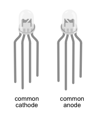
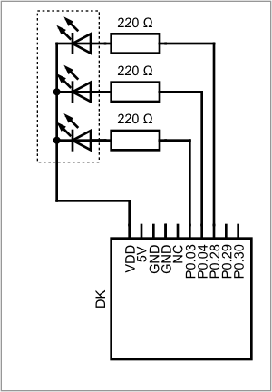

# External RGB LED

## Required Components

* 1 RGB LED
* 3 220 Ohm Resistors
* Breadboard
* Jumper cables

❗️❗️❗️ There are common anode and common cathode RGB LEDs. If you just took one from your stash, compare what the bulb of the LED looks like in relation to where the longest leg is:

We provide 
## Wiring

❗️❗️❗️ Before you start to wire things up, make sure, your breadboard and the nRF52840-DK is disconnected from any power source. 

### Common Anode RGB LED
 
We have provided two ways that depict the wiring of this setup:

A circuit diagram which is focused on showing what parts are connected in what ways. This type of diagram neglects physical appearance of the parts and how the parts arranged in the physical world. 

The breadboard diagram focuses on appearance of the parts and how they are arranged on a breadboard, while still showing the correct wiring. 

 

✅ Compare both diagrams for how they depict the RGB LED.

✅ Wire the parts according to the breadboard diagram. The longest leg of the LED is connected to VDD. The single leg on one side is the red channel, on the other side are the channels for blue and green. 

✅ Double check your wiring before connecting the board to the computer. 

### Common Cathode RGB LED

We have provided two ways that depict the wiring of this setup:

A circuit diagram which is focused on showing what parts are connected in what ways. This type of diagram neglects physical appearance of the parts and how the parts arranged in the physical world. 

The breadboard diagram focuses on appearance of the parts and how they are arranged on a breadboard, while still showing the correct wiring. 

 

✅ Compare both diagrams for how they depict the RGB LED.

✅ Wire the parts according to the breadboard diagram. The longest leg of the LED is connected to ground. The single leg on one side is the red channel, on the other side are the channels for green and blue. 

✅ Double check your wiring before connecting the board to the computer.

## Code

You can either work on the same file from the hello world example, or work on a copy of it. We asume, that you have access to the p0 pins. In the first example, we configured one pin. That one pin was special in the sense, that it only gives access to one of the onboard LEDs. Now we need three [GPIO](/knowledge.html#gpio) pins, one for red, one for blue one for green.

✅ Configute three gpio pins, P0.03, P0.04 and P0.28 into [push-pull-output](/knowledge.html#push-pull-output) pins, the initial level is High for common anode, and Low for common cathode. 

✅ Add a 1000ms delay. 

✅ Try running your code. If something lights up, you wrote code for the other type of LED. 

Using the methods `.set_high().unwrap();` or `.set_low().unwrap();` on each of the pins will change the status of your LED. 

✅ Try out all possible combinations of switching the channels on or off. What colors can you make?

✅ Build a blinking loop, where the LED blinks between two colors of your choice.

