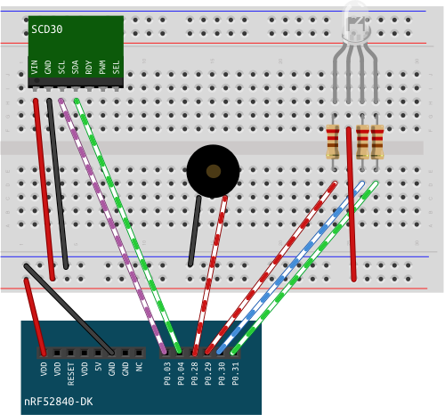

# Red Alert!

**This chapter will be refactored using pwm with the next release of the nrf-hal**

The CO<sub>2</sub> measuring device can now measure and display Carbon dioxide levels in its surroundings. In this chapter we add more interactivity: The device not only displays values but classifies the amount and acts accordingly: We define a normal level, a warning level and an upper limit for carbon dioxide in the air. All levels are indicated by the led, the upper limit will also have an acoustic warning from the buzzer. 

## Wiring

The buzzer has two legs, one goes into ground, the other into a pin. When having several devices connected to the board, make sure they are all connected to the same ground. 
The pins have been changed in this diagram so that the cables don't cross. You can stick with your old pin layout. 



## Implementation

### The Buzzer

The buzzer works pretty simple: It is connected to a pin and ground. Put the pin high, it makes noise, put the pin low, it's silent. Having the buzzer on all the time lets the buzzer buzz at the highest possible frequency. Building a method that switches the buzzer on and off with millisecond breaks in between lowers the frequency. 

✅ Create a module for the buzzer. Create a type with the following methods:
    * init: takes a pin and puts it into push pull output mode with the initial level low. 
    * on: puts the pin high.
    * off: puts the pin low.
    * buzz at lower frequency: switch the buzzer on and off with a break of one millisecond between each switch. Experiment with different break lengths.

✅ When initializing the sensor in `fn main()`, let the buzzer buzz for 500 ms, to test that it works. 

### CO<sub>2</sub> Alert

Since over 150 years, carbon dioxide concentration is seen as an indicator for the quality of indoor air. Carbon dioxide levels rise with human presence in rooms and with it the concentration of other emissions of humans (microorganisms and other gasses) rise and cause a decline in air quality. Carbon dioxide is not only an easy measurable equivalent, the gas itself has significant influence on cognition and at higher levels on your health. There are different regulations regarding air quality: DIN 13779 which regulates automated ventilation considers values below 800 ppm as indicative of highest air quality, values between 800 ppm and 1000 ppm as medium quality, values between 1000 ppm and 1400 ppm as mediocre quality and values above 1400 ppm as low quality. The 150 year old Pettenkofer number which regards values above 1000 ppm as bad quality is regarded outdated for the reasoning behind it, but it's still a useful number. [Current recommendations] regard values below 1000 ppm as quite safe, values between 1000 ppm and 2000 ppm as noticeable and values above 2000 ppm as unhygienic. For reducing the chance of catching the [corona virus], it is highly recommended to keep the value below 1000 ppm. 

✅ According to what you want to achieve with the sensor, what would be your warning level and what would be your upper limit of CO<sub>2</sub>?

✅ Create a new module for CO<sub>2</sub> alert. It contains the following:

    - defines the warning level of CO<sub>2</sub>.
    - defines the upper limit of CO<sub>2</sub>. 
    - contains a function that decides if the current CO<sub>2</sub> level is an alert or not:
    if the value is 
        - below warning level the led is green.
        - above warning level and below the upper limit, the led is yellow. 
        - above the upper limit, the led is red and the buzzer buzzes.

Help: 
Accessing other modules in a module:

```rust
use crate::rgb_led::LEDColor;
use crate::buzzer::Buzzer;
```
[corona virus]: https://publikationen.dguv.de/widgets/pdf/download/article/3873
[Current recommendations]: https://www.umweltbundesamt.de/sites/default/files/medien/4031/bilder/dateien/0_ausschuss_fuer_innenraumrichtwerte_leitwerte_20200224.pdf


### User Experience

Make the following experiment: If your carbon dioxide sensor detects concentrations above 2000 ppm and you open the window, how long does it take until the concentration is back to baseline at between 400 and 500 ppm? 

It takes probably longer then you expect. Leaving the buzzer on for the entire time is annoying and will not serve the purpose, as people will just turn it off completely. Having not only a visual but also an acoustic signal, when baseline is reached makes sense, as leaving the window open for an extended period of time in winter is a waste of energy. This is where we have a lot of freedom for design.

✅ Come up with your own signal scheme. What are the events that can come up? How would you like to be notified of them?

Here are some ideas:
Events:
- low humidity value (relevant in winter, with a lot of heating)
- carbon dioxide baseline (below 500 ppm)
- super high carbon dioxide level
- high humidity value (only relevant in rooms that are not heated)
- alert for temperatures, if you do not have a thermostat regulated heater but want to conserve energy. 

Notifications:
- notifications don't have to be on all the time, they can serve as a reminder and go on again, if conditions did not change after a certain amount of time has passed
- LEDs can blink or have a steady light, all in different colors
- a buzzer can buzz at different frequencies or change frequencies in one signal. 
- Lower frequencies are less alerting but still signaling, while higher frequencies create a sense of urgency. 

Other ideas:
- a snooze button
- an indicator for data not ready/ready


✅ Implement your scheme!