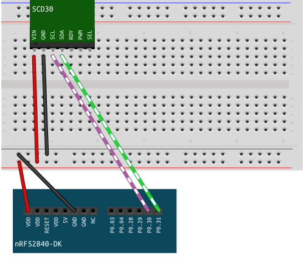

# Hello, Sensor!

On a high level, the driver we will write will be able to send different commands in form of bytes to the sensor. Depending on the command, the sensor will start or end a process or return data. The SCD30 can use three different protocols, we'll use I2C. 

An example of this implementation can be found here: [10_scd_30_log_v.rs](https://github.com/knurling-rs/knurling-sessions-20q4/blob/main/src/bin/10_scd_30_log_v.rs).

# Wiring 




# Prequisits

In your program, have access to the following resources: 

* Timer 
* P0 Pins 
* 1 LED

# Setting up the I2C resource

The resource we use is called twim. Twim and I2C are identical protocols, the difference is that the latter is trademarked, the former is not. 

✅ Bring the following modules into scope:

```rust

// access to board peripherals:
use nrf52840_hal::{
    self as hal,
    gpio::{
        p0::{
            Parts as P0Parts
        }, 
        Level,
    },
    prelude::*,
    Temp, 
    Timer,
    twim::{self, Twim, Error, Instance},
};
```


✅ In `fn main()` configure 2 pins as floating, one for the data signal (SDA) and one for the clock signal (SCL).


```rust
let scl = pins.p0_30.degrade();
let sda = pins.p0_31.degrade();
```

✅ Instantiate the pins as `twim::Pins`:

```rust
let pins = twim::Pins { scl, sda };
```

✅ Create a `Twim` instance. The method takes three arguments: `TWIM` peripheral, the `pins` and a frequency:

```rust
let i2c = Twim::new(board.TWIM0, pins, twim::Frequency::K100);
```
✅  Add a blinking loop at the end of the program. This is a way of creating a visual output, that your program is running.

```rust
loop {
        timer.delay(250_000);
        led_1.set_high().unwrap();
        timer.delay(250_000);
        led_1.set_low().unwrap();
    }
```

✅ Run the program. You should see a blinking LED. 


We built the I2C instance, it needs to be connected to the sensor's interface. For this, we need the sensor's address. 

✅ Find the sensor's adress in the [Interface Description][Interface Description] and add it as global variable `DEFAULT_ADDRESS` above `fn main()`. 

<details>
    <summary>Answer</summary>

    ```rust
    pub const DEFAULT_ADDRESS: u8 = 0x61;
    ```

  </details>


✅ Create a module `scd30` for the sensor.
Inside `src/scd30/mod.rs` create an anonymous struct as type alias for `Twim<T>`. 

```rust
pub struct SCD30<T: Instance>(Twim<T>);

impl<T> SCD30<T> where T: Instance {
    /// impl block
}
```

What are the `<T>`s?

I2C has the type `Twim<T>`, the `T` is a generic type parameter, that needs to be defined in the `struct`. When a generic type `<T>` is part of a type declaration for function arguments, it needs to be specified right after the function name. When implementing methods for that `struct` `<T>` needs to be specified and defined as well, but this happens in the opening line of the `impl` block. 


✅ Inside the `impl` block, create a static method that returns an instance of the `SCD30`. 

```rust
impl<T> SCD30<T> where T: Instance {

    pub fn init(i2c2: Twim<T>) -> Self {
        SCD30(i2c2)
    }

    /// other methods
}
```

Next, we'll create a method that can be used on a sensor instance. The purpose of the method is to write a command to the sensor that will allow us to read the sensor's firmware version number. In order to be able to do this, we need to find some information in the sensor's [Interface Description][Interface Description]:

✅ Find the I2C command for reading the firmware version.

 <details>
    <summary>Answer</summary>

    I2C `0xD100`

  </details>

✅ Find the message sequence that actually needs to be written to the sensor.

 <details>
    <summary>Answer</summary>

    Start 0xC2 0xD1 0x00 Stop

    Following the Start symbol you can find the byte that indicates that this is a *write* message: `0xC2`. This byte is one bit shift left from the sensor's address 0x61. It is already implemented in the `write()` method we will use, so we can ignore it for now. 

  </details>

✅ Find the message that is read from the sensor. How long is the actual information content in bytes?

 <details>
    <summary>Answer</summary>
    The message that is read:

    Start 0xC3 0x03 0x42 0xF3 Stop

    Notice the *read* byte. It is also just a bitshift away from the sensor's adress. After the *read* byte, are three bytes and the Stop symbol. Of the three bytes, the first is the major version number and the second is the minor version number, the last is a CRC byte. CRC is short for cyclic redundancy check which detects accidental changes in raw data. So the length of the actual information is 2 bytes.

    The `read()` method returns a byte array of all bytes following the *read* byte. 
</details>

✅ Calculate the Version number from the hexadecimal byte representation from the example. 

 <details>
    <summary>Answer</summary>

    |0x03|0x42|
    |----|----|
    |3   |66  |

    So the version number in this example is 3.66.

</details>


We'll go over this method in detail, because all other methods are just variations of this theme. 

✅ Add the method to the `SCD30` impl block.

```rust
pub fn get_firmware_version(&mut self) -> Result<[u8; 2], Error> {
    let command:[u8; 2] = [0xd1, 0x00];
    let mut rd_buffer = [0u8; 2];
        
    self.0.write(DEFAULT_ADDRESS, &command)?;
    self.0.read(DEFAULT_ADDRESS, &mut rd_buffer)?;

    let major = u8::from_be(rd_buffer[0]);
    let minor = u8::from_be(rd_buffer[1]);
        
    Ok([major, minor]) 
}
```

The method takes a mutable reference to `self` and returns a `Result` type, with an `Error` variant and an `ok` variant containing an `array` of two unsigned 8 bit integers. 

In the first line of the function body, we create an `array` of two `u8` containing the command that is sent to the sensor. Next, we create an empty read buffer that contains two zeroed u8, because we only need the first two bytes of the bytes that are returned. We can omit the CRC byte. 

Next, we call the `write()` method on the `SCD30`. It takes the address and a reference to the command as arguments. Then we call the read() method with the address and a mutable reference to the read buffer as arguments.

The last operation is converting the returned bytes into decimal numbers, and returning them as array. 


✅ Go to your program file and bring the `scd30` module into scope.

```rust
use knurling_session_20q4::scd30;
```

✅ In `fn main()`call the method on the sensor instance, and log the sensor's firmware version. 

```rust
let firmware_version = sensor.get_firmware_version().unwrap();
defmt::info!("Firmware Version: {:u8}.{:u8}", firmware_version[0], firmware_version[1]);
```

Run your program. You should get a version number as log output while the LED blinks.

Congratulations! You have written the first part of a hardware driver!

 [Interface Description]:https://www.sensirion.com/fileadmin/user_upload/customers/sensirion/Dokumente/9.5_CO2/Sensirion_CO2_Sensors_SCD30_Interface_Description.pdf
