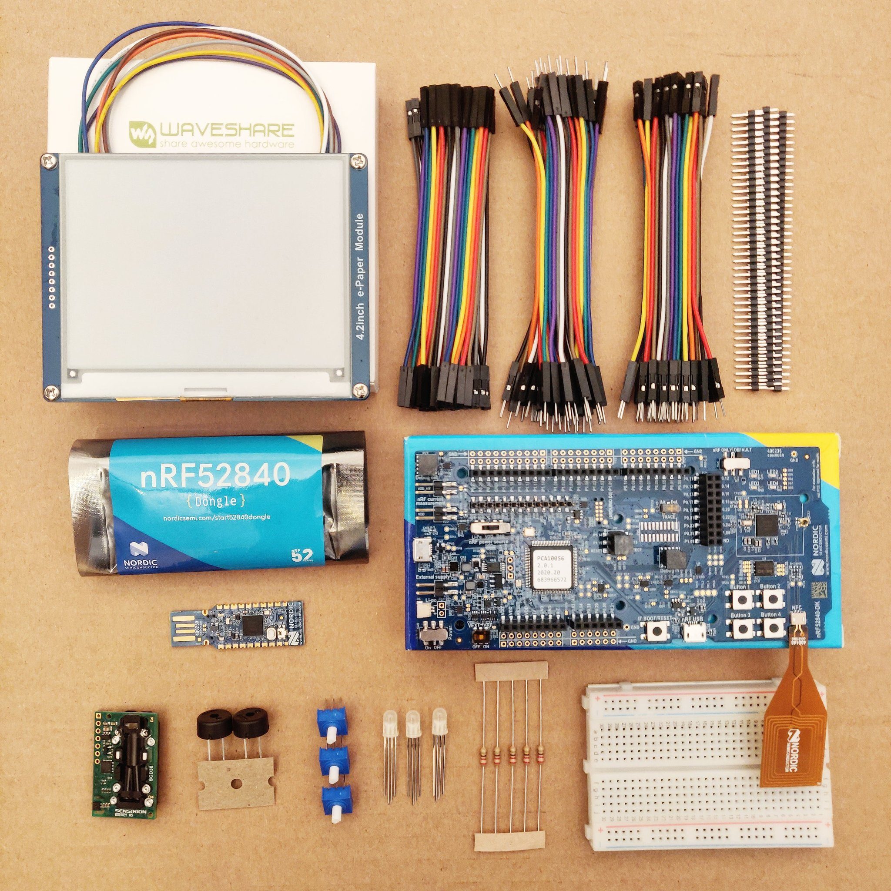

# Knurling Sessions 2020 Q4: Building a CO2 Sensor

In the first Knurling-sessions project, we will be incrementally building a CO2 sensor. This is not only a fun way to explore working with electronics and embedded Rust, in the end you'll also have a useful helper, especially if you're working from home: CO2 levels have a significant impact on your ability to concentrate and make decisions, and they drop faster than you think! The device we're building will tell you when it's time to open a window.

The first month is about learning some basics of embedded development and Rust. The SCD30 Sensor will be implemented in the second month. The third month is about embedded graphics and display.

## Example code
The example code and the source of this book can be found at [https://github.com/knurling-rs/knurling-session-20q4].

[https://github.com/knurling-rs/knurling-session-20q4]: https://github.com/knurling-rs/knurling-session-20q4

## Contribute
If something is unclear or you have a suggestion for the book please [open an issue], or send a PR!

[open an issue]: https://github.com/knurling-rs/knurling-session-20q4/issues/new/
